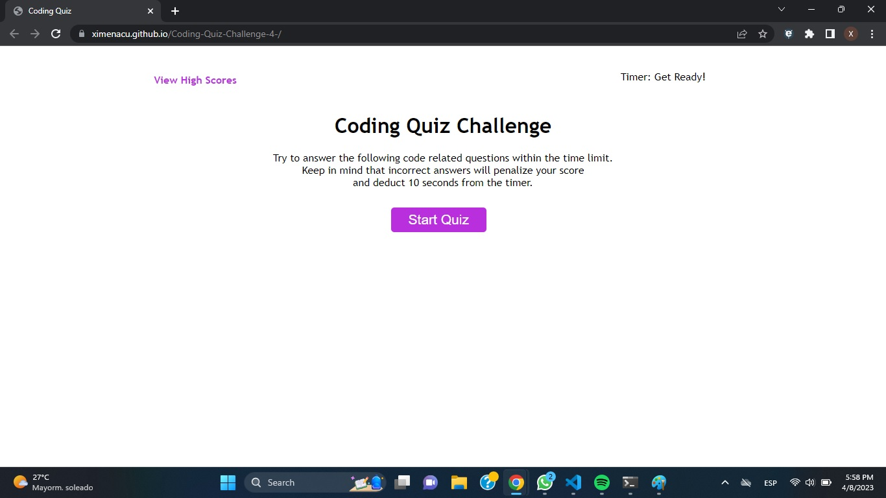

# Coding Quiz

Timed coding quiz with multiple-choice questions. 
This app runs in the browser, and features dynamically updated HTML and CSS powered by JavaScript.
Has a clean and polished user interface that is responsive, ensuring that it adapts to multiple screen sizes.

## URL of deployed app:
https://ximenacu.github.io/Coding-Quiz-Challenge-4-/

## URL of Git Hub 
https://github.com/Ximenacu/Coding-Quiz-Challenge-4-

## Acceptance Ariteria:
AS A coding boot camp student
I WANT to take a timed quiz on JavaScript fundamentals that stores high scores
SO THAT I can gauge my progress compared to my peers

## Acceptance Ariteria: 
GIVEN I am taking a code quiz:

* WHEN I click the start button
THEN a timer starts and I am presented with a question✅

* WHEN I answer a question
THEN I am presented with another question✅

* WHEN I answer a question incorrectly
THEN time is subtracted from the clock✅

* WHEN all questions are answered or the timer reaches 0
THEN the game is over✅

* WHEN the game is over
THEN I can save my initials and score ✅

### Additionally:
* The Challenge should not produce any errors in the console when you inspect it using Chrome DevTools. 
* Application deployed at live URL. ✅
* Application loads with no errors.✅
* Application GitHub URL submitted.  ✅
* Quality  
    * Application user experience is intuitive and easy to navigate.✅
    * Application user interface style is clean and polished. ✅
    * Application resembles the mock-up functionality provided in the Challenge instructions. ✅
* Repository 
    * Repository has a unique name. 
    * Repository follows best practices for file structure and naming conventions. 
    * Repository follows best practices for class/id naming conventions, indentation, high-quality comments, etc.
    * Repository contains multiple descriptive commit messages.
    * Repository contains a high-quality README file with description, screenshot, and link to deployed application. ✅

